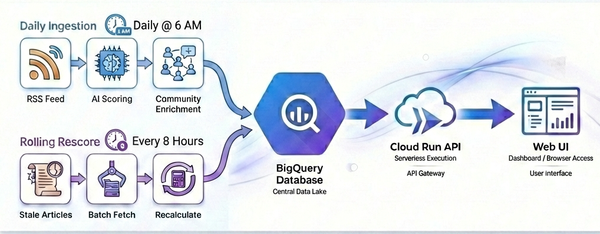

# Dev Caddie

> AI-powered content curation + voice briefings for engineers who don't have time to read everything

**Live Demo:** [devcaddie.com](https://devcaddie.com)

---

## Voice Briefing Service


Real-time voice briefings powered by **Gemini Live 2.5 Flash** with barge-in Q&A capability.

### How It Works

1. **Script Generation** - Airflow generates daily briefing scripts from top-scored articles
2. **Voice Synthesis** - Gemini Live converts scripts to natural audio via Pipecat + Daily WebRTC
3. **Barge-in Q&A** - Users can interrupt mid-briefing to ask questions about articles
4. **State Sync** - UI shows "Listening" vs "Speaking" states for seamless interaction

### Key Features

| Feature | Implementation |
|---------|----------------|
| **Deterministic Narration** | Pre-generated scripts for consistent delivery |
| **Live Q&A** | `allow_interruptions` toggle for barge-in |
| **Zero Latency** | WebRTC via Daily.co for real-time audio |
| **Cost: ~$0** | Vertex AI free tier (15 hrs audio/month) |

---

## Smart Feed Hub



> AI Agent-powered content curation with autonomous scoring and community validation


## 🎯 The Problem

As a software engineer, I was drowning in 100+ tech articles daily from 
50+ sources. 99% were noise. I needed AI to surface the signal.

## 💡 The Solution

Built an **Agentic Workflow** powered by Airflow:

1. **Scoring Agent** - LLM-powered agent (Gemini) that perceives article content, reasons about relevance using user interests, and outputs scores (0-100), topics, and actionability
2. **Community Enrichment Pipeline** - Fetches HackerNews + Lobsters engagement data, calculates community scores, detects viral thresholds
3. **Orchestration Layer** - Airflow DAGs coordinate the workflow on decay schedules (16h → 24h → 7d)

Result: 500 articles → 5-10 must-reads with 95%+ precision

## 🤖 Agentic Architecture

This is a **Single-Agent Pipeline** orchestrated by Airflow:

| Component | Type | Role |
|-----------|------|------|
| **Scoring Agent** | AI Agent (Gemini) | The cognitive core - perceives article content, reasons about relevance, outputs scores/topics/actionability |
| **Community Enrichment** | Data Pipeline | Fetches HN + Lobsters engagement data, calculates community scores (deterministic, not AI) |
| **Rescore Pipeline** | Data Pipeline | Re-checks community scores on decay schedule (16h → 24h → 7d) |
| **Airflow DAGs** | Orchestrator | Coordinates the agentic workflow - scheduling, retries, dependencies |

**Viral Override**: When community score exceeds threshold (70+), the system flips weighting from 70% AI / 30% Community to 30% AI / 70% Community - letting the crowd override the algorithm.

## 🏗️ Architecture

```
RSS Feeds (106 feeds via OPML)
       ↓
Airflow DAG (daily @ 13:00 UTC)
       ↓
┌──────────────────────────────────────────────────────────────┐
│  SCORING PIPELINE                                            │
│  ├─ Fetch & Dedupe (SHA-256 URL hashes)                      │
│  ├─ AI Scoring (Gemini 2.5 Flash → structured JSON)          │
│  ├─ Community Enrichment (HN Algolia + Lobste.rs APIs)       │
│  └─ Final Score = weighted(AI, Community) + viral override   │
└──────────────────────────────────────────────────────────────┘
       ↓
BigQuery (articles_scored, daily_briefings, lecture_notes)
       ↓
┌──────────────────────────────────────────────────────────────┐
│  DELIVERY LAYER                                              │
│  ├─ Cloud Run API (FastAPI + static UI)                      │
│  ├─ Voice Briefing (Sidecar VM: Pipecat + Daily + Gemini)    │
│  ├─ Feed Assistant (NL → StruQ → BigQuery)                   │
│  └─ Video Lecture Notes (Gemini vision + GCS snapshots)      │
└──────────────────────────────────────────────────────────────┘
```

### Components

| Component | Technology | Cost |
|-----------|------------|------|
| **Orchestration** | Apache Airflow 2.8 on GCE | ~$20/mo |
| **Backend** | FastAPI on Cloud Run | ~$0 (free tier) |
| **AI Scoring** | Gemini 2.5 Flash (Vertex AI) | ~$1/mo |
| **Voice Briefing** | Gemini Live + Pipecat + Daily WebRTC | ~$0 (free tier) |
| **Storage** | BigQuery + Firestore + GCS | ~$0 (free tier) |

<details>
<summary>Detailed Architecture (click to expand)</summary>

```text
┌─────────────────────────────────────────────────────────────────────────────────────────────────┐
│                       CONTENT INTELLIGENCE PLATFORM - AGENTIC WORKFLOW                          │
│                              Airflow-Orchestrated AI Pipeline                                   │
├─────────────────────────────────────────────────────────────────────────────────────────────────┤
│                                                                                                 │
│  ┌────────────────────────────────────────────────────────────────────────────────────────┐   │
│  │                              EXTERNAL DATA SOURCES                                      │   │
│  │  ┌──────────────┐  ┌──────────────┐  ┌──────────────┐  ┌──────────────┐              │   │
│  │  │    RSS       │  │ Hashnode RSS │  │ Medium RSS   │  │ HN RSS       │              │   │
│  │  └──────┬───────┘  └──────┬───────┘  └──────┬───────┘  └──────┬───────┘              │   │
│  │         │                 │                 │                 │                        │   │
│  │         └─────────────────┴─────────────────┴─────────────────┘                        │   │
│  │                                    │                                                    │   │
│  │                                    │ Fetch every 6 hours                               │   │
│  └────────────────────────────────────┼────────────────────────────────────────────────────┘   │
│                                       │                                                        │
│                                       ▼                                                        │
│  ┌────────────────────────────────────────────────────────────────────────────────────────┐   │
│  │                     COMPUTE ENGINE VM (e2-medium)                                       │   │
│  │                              $24/month                                                  │   │
│  │  ┌────────────────────────────────────────────────────────────────────────────────┐    │   │
│  │  │                         APACHE AIRFLOW (Docker)                                 │    │   │
│  │  │                                                                                 │    │   │
│  │  │  DAG 1: Content Intelligence Pipeline (every 6h)                              │    │   │
│  │  │  ┌──────────────────────────────────────────────────────────────────────┐     │    │   │
│  │  │  │  [Fetch RSS] ──> [Parse] ──> [Scoring Agent] ──> [Community] ──────┐│     │    │   │
│  │  │  │                                    │               │                ││     │    │   │
│  │  │  │                              ┌─────▼─────┐   ┌─────▼─────┐          ││     │    │   │
│  │  │  │                              │ Gemini AI │   │ HN + Lob  │          ││     │    │   │
│  │  │  │                              │ (0-100)   │   │ APIs      │          ││     │    │   │
│  │  │  │                              └─────┬─────┘   └─────┬─────┘          ││     │    │   │
│  │  │  │                                    └───────┬───────┘                ││     │    │   │
│  │  │  │                                            ▼                        ││     │    │   │
│  │  │  │                              ┌──────────────────────┐               ││     │    │   │
│  │  │  │                              │ Final Score Blend:   │               ││     │    │   │
│  │  │  │                              │ 70% AI + 30% Comm    │               ││     │    │   │
│  │  │  │                              │ (flips if viral!)    │               ││     │    │   │
│  │  │  │                              └──────────┬───────────┘               ││     │    │   │
│  │  │  │                                         ▼                           ▼│     │    │   │
│  │  │  │                              [Store BigQuery] <─────────────────────┘│     │    │   │
│  │  │  └──────────────────────────────────────────────────────────────────────┘     │    │   │
│  │  │                                                                                 │    │   │
│  │  │  DAG 2: Community Rescore Pipeline (every 8h)                                  │    │   │
│  │  │  ┌──────────────────────────────────────────────────────────────────────┐     │    │   │
│  │  │  │  [Query BQ: articles needing rescore] ──> [Batch HN/Lob APIs]       │     │    │   │
│  │  │  │                                                    │                 │     │    │   │
│  │  │  │  Decay Schedule:                                   ▼                 │     │    │   │
│  │  │  │  • 0-48h: check every 16h      [Match URLs locally] ──> [Update BQ] │     │    │   │
│  │  │  │  • 2-7d: check daily           (viral override if score >= 70)      │     │    │   │
│  │  │  │  • 7-30d: check weekly                                               │     │    │   │
│  │  │  └──────────────────────────────────────────────────────────────────────┘     │    │   │
│  │  │                                                                                 │    │   │
│  │  │  DAG 3: LLM Review Observability Pipeline                                      │    │   │
│  │  │  ┌──────────────────────────────────────────────────────────────────────┐     │    │   │
│  │  │  │                                                                       │     │    │   │
│  │  │  │  [Ingest Docs] ──> [Chunk & Embed] ──> [Vector Store] ──────┐       │     │    │   │
│  │  │  │                                                               │       │     │    │   │
│  │  │  │                                                               ▼       │     │    │   │
│  │  │  │  [User Query] ──> [RAG Retrieval] ──> [Gemini Review] ──> [Store]   │     │    │   │
│  │  │  │                          │                     │              │       │     │    │   │
│  │  │  │                          └─────────────────────┴──────────────┘       │     │    │   │
│  │  │  │                                     │                                 │     │    │   │
│  │  │  │                                     ▼                                 │     │    │   │
│  │  │  │                          [Track with MLflow]                          │     │    │   │
│  │  │  │                                                                       │     │    │   │
│  │  │  └───────────────────────────────────────────────────────────────────────┘     │    │   │
│  │  │                                                                                 │    │   │
│  │  │  Scheduler: 6-hour intervals                                                   │    │   │
│  │  │  Resources: 2 vCPU, 4 GB RAM                                                   │    │   │
│  │  │  Stack: Python, Docker Compose, PostgreSQL (metadata DB)                       │    │   │
│  │  │                                                                                 │    │   │
│  │  └─────────────────────────────────────────────────────────────────────────────────┘    │   │
│  │                                                                                          │   │
│  │  Monitoring: Google Cloud Ops agent installed                                           │   │
│  │  Logs: /var/log/airflow/* → Cloud Logging                                              │   │
│  │  Metrics: CPU, Memory, Disk → Cloud Monitoring                                         │   │
│  └──────────────────────────────────────┬───────────────────────────────────────────────────┘   │
│                                         │                                                       │
│                                         │ Writes processed data                                │
│                                         ▼                                                       │
│  ┌────────────────────────────────────────────────────────────────────────────────────────┐   │
│  │                              BIGQUERY (Storage Layer)                                   │   │
│  │                                   FREE TIER                                             │   │
│  │  ┌────────────────────────────────────────────────────────────────────────────────┐    │   │
│  │  │  Dataset: content_intelligence                                                 │    │   │
│  │  │                                                                                 │    │   │
│  │  │  Table: articles_scored                                                        │    │   │
│  │  │  ├─ article_id, title, url, source (STRING)                                   │    │   │
│  │  │  ├─ ai_relevance_score (INTEGER 0-100)                                        │    │   │
│  │  │  ├─ community_score (INTEGER 0-100)                                           │    │   │
│  │  │  ├─ final_score (INTEGER - blended)                                           │    │   │
│  │  │  ├─ hn_points, hn_comments, lobsters_points (INTEGER)                         │    │   │
│  │  │  ├─ is_trending, is_viral (BOOL)                                              │    │   │
│  │  │  ├─ last_community_check (TIMESTAMP)                                          │    │   │
│  │  │  ├─ community_check_count (INTEGER)                                           │    │   │
│  │  │  ├─ key_topics (ARRAY<STRING>)                                                │    │   │
│  │  │  └─ ai_reasoning, actionability, content_type (STRING)                        │    │   │
│  │  │                                                                                 │    │   │
│  │  │  Table: code_review_sessions                                                   │    │   │
│  │  │  ├─ session_id (STRING)                                                        │    │   │
│  │  │  ├─ code_snippet (STRING)                                                      │    │   │
│  │  │  ├─ review_result (STRING)                                                     │    │   │
│  │  │  ├─ retrieval_context (ARRAY<STRING>)                                         │    │   │
│  │  │  ├─ response_time_ms (INTEGER)                                                │    │   │
│  │  │  ├─ created_at (TIMESTAMP)                                                     │    │   │
│  │  │  └─ metadata (JSON)                                                            │    │   │
│  │  │                                                                                 │    │   │
│  │  │  Storage: ~1 GB/month (well within free tier)                                 │    │   │
│  │  └─────────────────────────────────────────────────────────────────────────────────┘    │   │
│  └──────────────────────────────────────┬───────────────────────────────────────────────────┘   │
│                                         │                                                       │
│                                         │ Queries data                                         │
│                                         ▼                                                       │
│  ┌────────────────────────────────────────────────────────────────────────────────────────┐   │
│  │                          CLOUD RUN (User-Facing API)                                    │   │
│  │                                 $5/month                                                │   │
│  │  ┌────────────────────────────────────────────────────────────────────────────────┐    │   │
│  │  │                         FastAPI Application                                     │    │   │
│  │  │                                                                                 │    │   │
│  │  │  Frontend: Multi-Tab Portfolio Interface                                       │    │   │
│  │  │  ┌──────────────────────────────────────────────────────────────────────┐     │    │   │
│  │  │  │                                                                       │     │    │   │
│  │  │  │  [Tab 1: Content Intelligence Hub]                                   │     │    │   │
│  │  │  │  ├─ AI Reading Assistant (Chat Interface)                            │     │    │   │
│  │  │  │  │  • Time-based recommendations                                     │     │    │   │
│  │  │  │  │  • Trending topics                                                │     │    │   │
│  │  │  │  │  • Topic curation                                                 │     │    │   │
│  │  │  │  │  • URL analyzer                                                   │     │    │   │
│  │  │  │  │  • What's new detection                                           │     │    │   │
│  │  │  │  ├─ Architecture diagram                                             │     │    │   │
│  │  │  │  ├─ Dual-scoring explanation                                         │     │    │   │
│  │  │  │  ├─ Live demo                                                        │     │    │   │
│  │  │  │  └─ Links: GitHub, Dev.to post, Medium articles                     │     │    │   │
│  │  │  │                                                                       │     │    │   │
│  │  │  │  [Tab 2: LLM Review Observability]                                   │     │    │   │
│  │  │  │  ├─ Code review demo (submit code → get AI review)                  │     │    │   │
│  │  │  │  ├─ RAG pipeline visualization                                       │     │    │   │
│  │  │  │  ├─ Multi-stage observability                                        │     │    │   │
│  │  │  │  ├─ Datadog screenshots                                              │     │    │   │
│  │  │  │  ├─ Architecture diagram                                             │     │    │   │
│  │  │  │  └─ Links: GitHub, blog post                                         │     │    │   │
│  │  │  │                                                                       │     │    │   │
│  │  │  │  [Tab 3: About Me]                                                    │     │    │   │
│  │  │  │  ├─ 15 years backend + platform engineering                          │     │    │   │
│  │  │  │  ├─ Data Platform Engineer positioning                               │     │    │   │
│  │  │  │  ├─ Synopsys experience (30 services, 150 containers)                │     │    │   │
│  │  │  │  ├─ Certifications (Databricks, CKAD)                                │     │    │   │
│  │  │  │  ├─ Tech stack showcase                                              │     │    │   │
│  │  │  │  └─ Contact info                                                     │     │    │   │
│  │  │  │                                                                       │     │    │   │
│  │  │  └───────────────────────────────────────────────────────────────────────┘     │    │   │
│  │  │                                                                                 │    │   │
│  │  │  Backend: API Endpoints                                                        │    │   │
│  │  │  ├─ POST /api/assistant (Content Intelligence chat)                            │    │   │
│  │  │  ├─ GET  /api/articles (Query processed articles)                              │    │   │
│  │  │  ├─ GET  /api/articles/trending (Trending topics)                              │    │   │
│  │  │  ├─ POST /api/analyze-url (Analyze specific URL)                               │    │   │
│  │  │  ├─ POST /api/review (Code review with RAG)                                    │    │   │
│  │  │  ├─ GET  /metrics (Prometheus metrics)                                         │    │   │
│  │  │  └─ GET  /health (Health check)                                                │    │   │
│  │  │                                                                                 │    │   │
│  │  │  Rate Limiting:                                                                │    │   │
│  │  │  ├─ 10 requests/minute per IP                                                  │    │   │
│  │  │  ├─ 50 requests/hour per IP                                                    │    │   │
│  │  │  └─ 200 requests/day per IP                                                    │    │   │
│  │  │                                                                                 │    │   │
│  │  │  Auto-scaling: 0-10 instances                                                  │    │   │
│  │  │  Concurrency: 80 requests per instance                                         │    │   │
│  │  │  Min instances: 0 (scales to zero when idle)                                   │    │   │
│  │  │                                                                                 │    │   │
│  │  │  Instrumentation:                                                              │    │   │
│  │  │  ├─ OpenTelemetry (traces)                                                     │    │   │
│  │  │  ├─ Custom metrics (response time, token usage)                                │    │   │
│  │  │  ├─ MLflow (experiment tracking)                                               │    │   │
│  │  │  └─ Error tracking                                                             │    │   │
│  │  │                                                                                 │    │   │
│  │  └─────────────────────────────────────────────────────────────────────────────────┘    │   │
│  │                                                                                          │   │
│  │  URL: https://content-intelligence-hub.run.app                                          │   │
│  │  Stack: FastAPI, Python, Docker, HTML/CSS/JavaScript                                    │   │
│  └──────────────────────────────────────┬───────────────────────────────────────────────────┘   │
│                                         │                                                       │
│                                         │ Sends requests                                       │
│                                         ▼                                                       │
│  ┌────────────────────────────────────────────────────────────────────────────────────────┐   │
│  │                            GEMINI API (AI Processing)                                   │   │
│  │                                  $6/month                                               │   │
│  │  ┌────────────────────────────────────────────────────────────────────────────────┐    │   │
│  │  │  Model: Gemini 1.5 Flash                                                       │    │   │
│  │  │                                                                                 │    │   │
│  │  │  Use Cases:                                                                     │    │   │
│  │  │  1. Article Analysis (Content Intelligence)                                    │    │   │
│  │  │     ├─ Extract key topics                                                      │    │   │
│  │  │     ├─ Score personal relevance (0-100)                                        │    │   │
│  │  │     ├─ Assess quality signal                                                   │    │   │
│  │  │     └─ Generate summary                                                        │    │   │
│  │  │                                                                                 │    │   │
│  │  │  2. Conversational Assistant                                                   │    │   │
│  │  │     ├─ Answer user queries                                                     │    │   │
│  │  │     ├─ Recommend articles                                                      │    │   │
│  │  │     └─ Explain trends                                                          │    │   │
│  │  │                                                                                 │    │   │
│  │  │  3. Code Review Generation (LLM Observability)                                 │    │   │
│  │  │     ├─ Analyze code quality                                                    │    │   │
│  │  │     ├─ Suggest improvements                                                    │    │   │
│  │  │     └─ RAG-enhanced context                                                    │    │   │
│  │  │                                                                                 │    │   │
│  │  │  Rate Limits:                                                                  │    │   │
│  │  │  ├─ Daily budget cap: $5/day                                                   │    │   │
│  │  │  ├─ ~1000 requests/month                                                       │    │   │
│  │  │  └─ $0.0002 per article                                                        │    │   │
│  │  │                                                                                 │    │   │
│  │  └─────────────────────────────────────────────────────────────────────────────────┘    │   │
│  └──────────────────────────────────────────────────────────────────────────────────────────┘   │
│                                                                                                 │
│  ┌────────────────────────────────────────────────────────────────────────────────────────┐   │
│  │                   GOOGLE CLOUD OPERATIONS (Observability)                               │   │
│  │                                   FREE                                                  │   │
│  │  ┌────────────────────────────────────────────────────────────────────────────────┐    │   │
│  │  │                                                                                 │    │   │
│  │  │  Cloud Trace (Distributed Tracing)                                             │    │   │
│  │  │  ├─ API request traces                                                         │    │   │
│  │  │  ├─ Airflow task traces                                                        │    │   │
│  │  │  ├─ BigQuery query traces                                                      │    │   │
│  │  │  ├─ Gemini API call traces                                                     │    │   │
│  │  │  └─ End-to-end latency visualization                                           │    │   │
│  │  │                                                                                 │    │   │
│  │  │  Cloud Monitoring (Metrics & Dashboards)                                       │    │   │
│  │  │  ├─ VM metrics (CPU, memory, disk)                                            │    │   │
│  │  │  ├─ Cloud Run metrics (requests, latency, errors)                             │    │   │
│  │  │  ├─ Custom metrics (article processing rate, relevance scores)                │    │   │
│  │  │  ├─ BigQuery metrics (query performance)                                      │    │   │
│  │  │  └─ Custom dashboards                                                         │    │   │
│  │  │                                                                                 │    │   │
│  │  │  Cloud Logging (Log Aggregation)                                              │    │   │
│  │  │  ├─ Airflow logs (scheduler, webserver, tasks)                                │    │   │
│  │  │  ├─ Cloud Run logs (requests, errors, traces)                                 │    │   │
│  │  │  ├─ Application logs (debug, info, error)                                     │    │   │
│  │  │  └─ Log-based metrics                                                         │    │   │
│  │  │                                                                                 │    │   │
│  │  │  Error Reporting                                                               │    │   │
│  │  │  ├─ Automatic error detection                                                 │    │   │
│  │  │  ├─ Error grouping                                                            │    │   │
│  │  │  ├─ Stack trace analysis                                                      │    │   │
│  │  │  └─ Alert integration                                                         │    │   │
│  │  │                                                                                 │    │   │
│  │  │  Alerting                                                                      │    │   │
│  │  │  ├─ High error rate (>5%)                                                     │    │   │
│  │  │  ├─ API latency (>2s p95)                                                     │    │   │
│  │  │  ├─ VM CPU/Memory (>90%)                                                      │    │   │
│  │  │  ├─ Daily budget exceeded                                                     │    │   │
│  │  │  └─ Airflow DAG failures                                                      │    │   │
│  │  │                                                                                 │    │   │
│  │  │  Free Tier Limits:                                                            │    │   │
│  │  │  ├─ 50 GB logs/month ✅                                                        │    │   │
│  │  │  ├─ All traces (unlimited) ✅                                                  │    │   │
│  │  │  └─ 150 GB metrics ingestion/month ✅                                          │    │   │
│  │  │                                                                                 │    │   │
│  │  └─────────────────────────────────────────────────────────────────────────────────┘    │   │
│  └──────────────────────────────────────────────────────────────────────────────────────────┘   │
│                                                                                                 │
│  ┌────────────────────────────────────────────────────────────────────────────────────────┐   │
│  │                      OPTIONAL: DATADOG (Demo Period Only)                               │   │
│  │                              14-Day Trial                                               │   │
│  │  ┌────────────────────────────────────────────────────────────────────────────────┐    │   │
│  │  │  Used ONLY for Week 3-4 (Hackathon Submission)                                │    │   │
│  │  │                                                                                 │    │   │
│  │  │  Agent installed on:                                                           │    │   │
│  │  │  ├─ Compute Engine VM                                                          │    │   │
│  │  │  └─ Cloud Run (via OpenTelemetry)                                             │    │   │
│  │  │                                                                                 │    │   │
│  │  │  Purpose:                                                                      │    │   │
│  │  │  ├─ Create beautiful dashboards (screenshots for blog)                        │    │   │
│  │  │  ├─ Record demo video                                                         │    │   │
│  │  │  ├─ Show multi-stage observability                                            │    │   │
│  │  │  └─ Submit to GCP/Datadog hackathon                                           │    │   │
│  │  │                                                                                 │    │   │
│  │  │  After trial expires:                                                          │    │   │
│  │  │  ├─ Remove Datadog agent                                                      │    │   │
│  │  │  ├─ Keep Google Cloud Ops (free forever)                                      │    │   │
│  │  │  └─ Portfolio stays live at $25/month                                         │    │   │
│  │  │                                                                                 │    │   │
│  │  └─────────────────────────────────────────────────────────────────────────────────┘    │   │
│  └──────────────────────────────────────────────────────────────────────────────────────────┘   │
│                                                                                                 │
└─────────────────────────────────────────────────────────────────────────────────────────────────┘
```

</details>


## 📊 Key Features

### Dual-Scoring System
- **AI Relevance Score** (0-100): Scoring Agent analyzes content against your subscribed feed interests
- **Community Score** (0-100): Aggregated from HackerNews points + Lobsters engagement
- **Final Score**: Blended 70% AI + 30% Community (flips to 30/70 on viral content)
- **Viral Override**: When community score >= 70, let the crowd override the algorithm

### AI Reading Assistant
- Conversational interface
- Time-based recommendations
- Real-time article analysis
- Trend detection

### Tech Highlights
- **Agentic Workflow**: Scoring Agent + Community Pipelines orchestrated by Airflow
- **Decay-based Rescoring**: Articles re-checked on schedule (16h → 24h → 7d → stop)
- **Batch API Calls**: HN Algolia + Lobsters fetched in bulk, matched locally
- **Rate-limited API**: Prevents abuse
- **$0.0002 per article**: Batch LLM processing for 10x cost reduction

## 🛠️ Tech Stack

- Apache Airflow 2.8
- Google Cloud Run
- Google BigQuery
- Gemini 1.5 Flash
- FastAPI
- Docker

## 📈 Results

- **Reading time**: 2 hours → 15 minutes daily
- **Relevance accuracy**: 94%+
- **Processing cost**: $0.0002/article
- **Total cost**: $25/month


## 🏆 Gemini 3 Challenge 2025


**What I Learned:**
- Agentic workflow design (Scoring Agent + orchestration)
- Apache Airflow for autonomous pipeline coordination
- Cost-effective LLM API usage (batching strategies)
- Community signal aggregation (HN/Lobsters APIs)
- Decay scheduling for rolling score updates

## 📝 License

MIT

---
